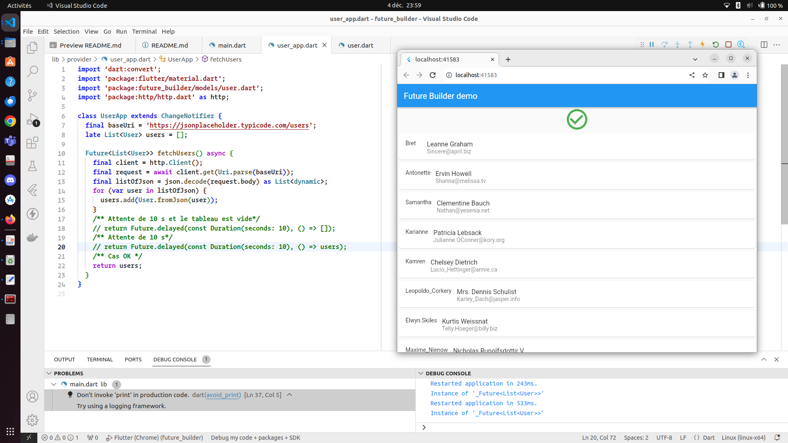
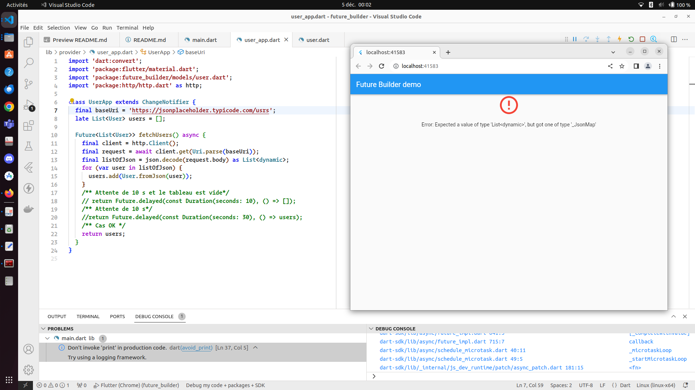
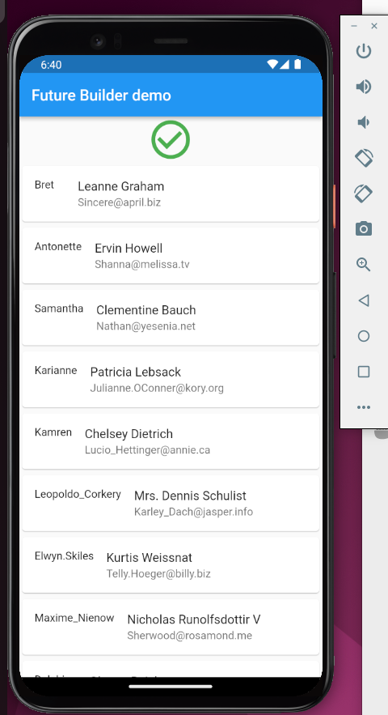

# future_builder

## Clone Project
``` 
git clone ...
``` 

## Veille Flutter : FUTURE BUILDER

Le widget FutureBuilder, pour créer des widgets qui se build en interagissant avec des Future (traitement asynchrone)

## Consignes

Choisissez un widget au choix parmi la liste précédente et créer une application Flutter minimale pour illustrer l’usage du Widget ou du paquet choisi. 
- Faites une application qui vise la plateforme Android. Documenter votre application avec un README qui donnera les
instructions nécessaires pour lancer l’application et installer les dépendances. 

- Dans le README, ajoutez une section qui porte le nom du widget exploré/paquet exploré et rédiger les instructions
pour utiliser votre démo (guide utilisateur).

- Pour votre mini-application de veille, vous pouvez vous inspirer des exemples de la documentation mais vous ne pouvez pas vous contenter de copier/coller du code source donné en exemple.
La qualité du document et le respect des consignes sera pris en compte dans la note. Merci de penser au correcteur.

## Ajout de la dépendance http
``` 
flutter pub add http
flutter pub add provider
flutter pub get
```

## Travail sur FutureBuilder

J'ai mis en place plusieurs scénarios possibles:


- ## OK

Ici, c'est le cas normal:
- J'ai créé un provider pour diffuser des données dans le composant 
- Mis en place de FutureBuilder avec ses concepts (future, builder, snapshot)
- J'ai mis les conditions pour les différents comme sur la documentation:

_**EN ATTENTE**_
```DART
  if (snapshot.connectionState == ConnectionState.waiting)
```
_**RESPONSE OK**_
```DART
 if (snapshot.connectionState == ConnectionState.done)
```
- On a une reponse avec une erreur
```DART
 if (snapshot.connectionState == ConnectionState.done)
```  
- Si on a de la data
```DART
 } else if (snapshot.hasData) {
```
- Si aucune des données sont disponibles
```DART
} else {
    return const Text('Aucune donnée disponible.');
}

- On retourne le status de la connection du snapshot avec son exception
```DART
} else {
    return Text('State: ${snapshot.connectionState}');
}
```
- ## Error

Pour cette étape, j'ai mis une erreur dans l'adresse de récupération des données.En forçant sur le relancement de l'application, on obtient cette erreur.
```DART
final baseUri = 'https://jsonplaceholder.typicode.com/users';
```
à la place de users en laissant le :
```DART
 return users
```

- ## Waiting


Ici, on a le déroulement normal d'attente du loader de l'application.

- ## Mise en place de la connexion android dans le manifeste
```Dart
  <uses-permission android:name="android.permission.INTERNET" />
```


